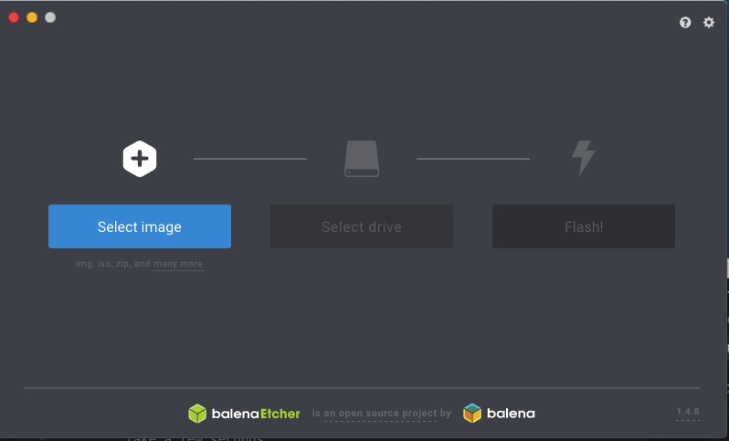

Welcome to a beginning guide on creating your own portable Raspberry Pi penetration tester running the re4son kernel.

    This will create a dropbox Raspberry Pi with Kali Linux OS ready to start learning and performing some white hat or black hat WiFi attacks.

    What you will need:

    1. Raspberry Pi $30 on Amazon
        Note: I went with the Raspberry Pi 3 B+ which comes with a broadcom Wifi chip on board. Keep in mind that this chip is limited in its capabilities and requires a patch to enable monitoring mode. Having a monitoring mode enabled WiFi adapter as well as one capable of packet injection will be required to start performing some simple WiFi attacks such as DOS or Man in the Middle/ Evil Twin attacks.

    2. Power adapter  $7 - $15 (One I used - $10)
        You want to have a dedicated 2.5A power adapter for you Raspberry Pi. Not having the right power input to the device can cause problems with booting the device, getting the GUI (Graphical Interface) to display, USB port use, etc.

    3. Keyboard (optional)
        A USB or bluetooth keyboard. I recommend using a USB keyboard because Kali Linux ARM images widely have issues setting up bluetooth out of the box but bluetooth is fine if you use the re4son kernel which comes pre-built with the bluetooth functionality up and running. This tutorial does not require a dedicated USB or bluetooth keyboard.

    4. Mouse (optional)
        Like the keyboard USB is preferable but not necessary with this tutorial.

    5. HDMI cable (optional)
        An HDMI cable is very helpful if you have the aforementioned mouse and keyboard but not necessary for this tutorial. Everything will be done with SSH and further steps can be taken to view and control your Kali-Pi on your desktop, laptop, or phone, remotely using the x4cfe GUI that comes with the Kali Linux distribution.

    6. Micro SD card and Micro SD adapter

    7. WiFi adapter - $30
        This is very important if you want to get started performing attacks and increase their effectiveness.

        I went with the Long-Range ALPHA AWUS360NEH USB portable WiFi adapter that supports monitor mode and packet injection. There are others that are cheaper, medium-range but if you're going to buy a different adapter do your research about whether or not the chipset supports monitor mode and packet injection out of the box and some attacks like the Evil Twin/Man in the Middle attack I will discuss later require around 30dbs of transmit power.

This should be enough to get you going. You can add other peripherals but right now this keeps our build below $100 and is relatively simple.

Steps

1. We're going to make an image of the correct ARM distribution. Go [here](https://whitedome.com.au/re4son/sticky-fingers-kali-pi-pre-installed-image/) and download the correct re4son kernel image for your Raspberry Pi. There are others [here](https://www.offensive-security.com/kali-linux-arm-images/) with directions on how to verify the checksums.

2. You need to format the micro SD card in order to flash it with the correct Kali Linux distribution. I did this on a Macbook so my commands will work with UNIX devices and are very similar to LINUX.
  You have two options here:

    - You can flash your micro SD using the command line Interface
    - You can download some simple apps that allow this to be done through a GUI

  I will show both so the choice is yours. If you're not comfortable with the command line or you're not certain about what to enter and where when following the steps I highly recommend using the GUI application because there is no chance of writing over your main pc or laptop's boot disk that way.

    A. Command Line:
    -  Before* inserting the micro SD, open a terminal window and input

       `diskutil list`

      This will list all mounted drives and their partitions. You want to run this before inserting the micro SD because it will tell you exactly what you don't want to touch.

    - Now insert your micro SD card/adapter into your computer and re-run

        `diskutil list`

        or you can also use:

        `df -h`

        Make note of the change. For example your terminal will display something like:

        `/dev/disk6 (disk image):
   #:                       TYPE NAME                    SIZE       IDENTIFIER
   0:                        FAT_32                      +31.6 MB    disk5
   1:                  Apple_HFS FAT_32                   31.5 MB    disk5s1`

        You want to make note of the `/dev/diskX` because this is where you'll be writing your Kali Linux image to and performing some commands on to prepare your Raspberry Pi.

      - After you have the correct attached disk you're going to format and over write run:

        `diskutil unmount /dev/diskX`

          I cannot stress enough how important it is to get this step correctly and have the correct `/dev/disk...`

        - Now you're ready to load your re4son Kali-Pi image to your micro SD card.

            Navigate to the location of your downloaded image. The default on Mac's is to place them in the `/Downloads` folder so run:

          `cd Downloads`

            Next you'll be running the `dd` command. This is very powerful so be careful because there is a risk of overwriting or corrupting your computer's hard disk.

            Run:
            `dd if=StickyFingers-Kali-Pi-armhf-180923.img of=/dev/diskX bs=512k`

            Let this process finish it may take anywhere from 1 to 10 minutes. Just enough for you to connect any or all of the peripherals you want to you Raspberry Pi.

            You can check the status of the process by pressing:

            `control + t` at the same time.

            Now you're ready to boot.

      I will go through the GUI application process.

      B. GUI format and install

        1. Download an [SD card formatter](https://www.sdcard.org/downloads/formatter_4/) <- I recommend this one which is available for Mac and Windows.

        2. Install and run application

        3. Select your micro SD card from the drop down window. If it's the only micro SD you have connected it will only show the correct micro SD.

        4. Select Overwrite or Quick Format then click "Format". This may take a few seconds.

        5. Now you are ready to flash the micro SD card but and there's a great program to that for you called "BalenaEtcher". Go [here](https://www.balena.io/etcher/) and download the applicable software for your OS, it supports Mac, Windows and Linux.

        6. Now install and run BalenaEtcher. You will see:
      

            1. Select the correct image
            2. Select the Micro SD card
            3. Select Flash
            4. Wait
          Give it a few minutes to flash and validate the image
            5. Eject Micro SD

  Now your Micro SD is ready with the bootable image and your Raspberry Pi should be ready with all your peripherals connected.

      7. Plug your power adapter in and connect the Raspberry Pi.

          This will automatically boot Kali Linux on your Raspberry Pi. If all is well you should see a red light come on next to the power connection and a green light as well. If you're connected to a monitor you should see your Kali Linux distribution booting up.

    The default username and password on all Kali linux distributions are
      - username: root
      - password: toor

Key* - To get your Kali Pi working through SSH is being able to bypass the initial login prompt without connecting the keyboard and mouse the 1st time you boot up your Raspberry Pi. This will show you all the necessary steps.

    "toor" password is very secure so lets change this.

      1. SSH into your Raspberry Pi
        Run in terminal:
          `ssh -X root@[IP address]`

        `-X` or `-Y` will tell your computer to allow for X11 forwarding so you can see Kali Linux GUI in a window.

        The SSH session will ask for a password, enter:
        `toor`

        Now you're ready to change that password.
          Run in terminal:
          `passwd root`
          This will ask you to enter a new password. Enter it twice, letters will not show by default.

        Now update your OS:
            Run:
            `apt-get update`
            `apt-get upgrade`
            `apt-get dist-upgrade`

      With the re4son kernel this will take several minutes. You can look up some quick guides about Kali Linux in the meantime or make some coffee.

      Now you want to install the openSSH server and update it to allow SSH when you Raspberry Pi boots, so run:

        - `apt-get install openssh-server`
        - `update-rc.d -f ssh remove`
        - `update-rc.d -f ssh defaults`

         Since the default keys are easy to guess and represent a vulnerability to Man-in-the-middle-attacks. We want to generate new ones.
          Run:
          `cd /etc/ssh`
          `mkdir insecure_old`
          `mv ssh_host* insecure_old`
          `dpkg-reconfigure openssh-server`

          This backs up he old SSH keys in a new folder called "insecure_old" and generates new ones

          Now you want to enable login through root:
            Run:
              `nano /etc/ssh/sshd_config`
              This will open the SSH config file and allow you to change it.

              Look for:
              `PermitRootLogin`
              and make sure it is unhashed so it reads:
              `PermitRootLogin yes`
              instead of
              `PermitRootLogin without-password`
              Save changes with : `control + X`
              Then type: `y` and hit "Enter/Return"

              Now restart the SSH service with:
              `service ssh restart`
              `update-rc.d -f ssh enable 2 3 4 5`

              Check that SSH is working:
              `service ssh status`

              If it isn't run:
              `service ssh start`

      2. Enable Autologin
          Run:
          `cd /usr/local/src/re4son-kernel_4*`
          `./re4son-pi-tft-setup -a root`

          Type : `Y` to confirm and reboot

      3. Enable Bluetooth and Scan for bluetooth devices
          Run:
            `bluetooth ctl`

          Turn on bluetooth agent by running:
            `agent on`

          Next Run:
            `default agent`

          Now turn on scan:
            Run:
              `scan on`

          This will tell your Kali Pi to scan for bluetooth devices and show their MAC addresses.

          To pair with a bluetooth device run:
            `pair [MAC address]`
          This may not work for many bluetooth devices but it's good to know as you learn more you can explore bluetooth hacking with your Raspberry Pi.
